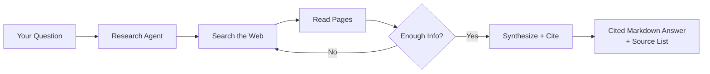

> For clean Markdown of any page, append .md to the page URL.
> For a complete documentation index, see https://you.com/docs/llms.txt.
> For AI client integration (Claude Code, Cursor, etc.), connect to the MCP server at https://you.com/docs/_mcp/server.

# Research Agent

## When a Simple Search Isn't Enough

You've used the Search API. You send a query, you get back a list of web results—titles, URLs, snippets. It works great for quick lookups, building search UIs, and feeding results into RAG pipelines.

But some questions need more than a list of links. Questions like "what are the latest breakthroughs in quantum computing" or "how do mRNA vaccines work" need someone (or something) to actually read through dozens of sources, cross-reference them, and write up a coherent answer with citations.

That's what the Research API does. It's like having a research assistant that reads the web and writes you a report with footnotes.

---

## Try It Live

Run a real Research API request right here—no setup. Open the **Try It** panel below, paste your API key, edit the `input`, and send it against the live endpoint. (Research can take up to \~60s at higher effort levels.)

### Request

POST [https://api.you.com/v1/research](https://api.you.com/v1/research)

```python Basic example
from youdotcom import You
from youdotcom.models import ResearchEffort

you = You()

res = you.research(
    input="Which global cities improved air quality the most over the past 10 years, and what measurable actions contributed?",
    research_effort=ResearchEffort.LITE,
)

print(res.output.content)

for i, source in enumerate(res.output.sources, 1):
    print(f"[{i}] {source.title or 'Untitled'}: {source.url}")

```

```typescript Basic example
import { You } from "@youdotcom-oss/sdk";
import type { ResearchRequest } from "@youdotcom-oss/sdk/models/operations";
import { ResearchEffort } from "@youdotcom-oss/sdk/models/operations";

const you = new You({ apiKeyAuth: process.env.YDC_API_KEY });

const request: ResearchRequest = {
  input: "Which global cities improved air quality the most over the past 10 years, and what measurable actions contributed?",
  researchEffort: ResearchEffort.Lite,
};

const result = await you.research(request);

console.log(result.output.content);

result.output.sources.forEach((s, i) => {
  console.log(`[${i + 1}] ${s.title ?? s.url}: ${s.url}`);
});

```

```javascript Basic example
import { You } from "@youdotcom-oss/sdk";
import { ResearchEffort } from "@youdotcom-oss/sdk/models/operations";

const you = new You({ apiKeyAuth: process.env.YDC_API_KEY });

const result = await you.research({
  input: "Which global cities improved air quality the most over the past 10 years, and what measurable actions contributed?",
  researchEffort: ResearchEffort.Lite,
});

console.log(result.output.content);

result.output.sources.forEach((s, i) => {
  console.log(`[${i + 1}] ${s.title ?? s.url}: ${s.url}`);
});

```

```curl Basic example
curl -X POST https://api.you.com/v1/research \
     -H "X-API-Key: <apiKey>" \
     -H "Content-Type: application/json" \
     -d '{
  "input": "Which global cities improved air quality the most over the past 10 years, and what measurable actions contributed?",
  "research_effort": "lite"
}'
```

```go Basic example
package main

import (
	"fmt"
	"strings"
	"net/http"
	"io"
)

func main() {

	url := "https://api.you.com/v1/research"

	payload := strings.NewReader("{\n  \"input\": \"Which global cities improved air quality the most over the past 10 years, and what measurable actions contributed?\",\n  \"research_effort\": \"lite\"\n}")

	req, _ := http.NewRequest("POST", url, payload)

	req.Header.Add("X-API-Key", "<apiKey>")
	req.Header.Add("Content-Type", "application/json")

	res, _ := http.DefaultClient.Do(req)

	defer res.Body.Close()
	body, _ := io.ReadAll(res.Body)

	fmt.Println(res)
	fmt.Println(string(body))

}
```

```java Basic example
import com.mashape.unirest.http.HttpResponse;
import com.mashape.unirest.http.Unirest;

HttpResponse<String> response = Unirest.post("https://api.you.com/v1/research")
  .header("X-API-Key", "<apiKey>")
  .header("Content-Type", "application/json")
  .body("{\n  \"input\": \"Which global cities improved air quality the most over the past 10 years, and what measurable actions contributed?\",\n  \"research_effort\": \"lite\"\n}")
  .asString();
```

```csharp Basic example
using RestSharp;

var client = new RestClient("https://api.you.com/v1/research");
var request = new RestRequest(Method.POST);
request.AddHeader("X-API-Key", "<apiKey>");
request.AddHeader("Content-Type", "application/json");
request.AddParameter("application/json", "{\n  \"input\": \"Which global cities improved air quality the most over the past 10 years, and what measurable actions contributed?\",\n  \"research_effort\": \"lite\"\n}", ParameterType.RequestBody);
IRestResponse response = client.Execute(request);
```

```swift Basic example
import Foundation

let headers = [
  "X-API-Key": "<apiKey>",
  "Content-Type": "application/json"
]
let parameters = [
  "input": "Which global cities improved air quality the most over the past 10 years, and what measurable actions contributed?",
  "research_effort": "lite"
] as [String : Any]

let postData = JSONSerialization.data(withJSONObject: parameters, options: [])

let request = NSMutableURLRequest(url: NSURL(string: "https://api.you.com/v1/research")! as URL,
                                        cachePolicy: .useProtocolCachePolicy,
                                    timeoutInterval: 10.0)
request.httpMethod = "POST"
request.allHTTPHeaderFields = headers
request.httpBody = postData as Data

let session = URLSession.shared
let dataTask = session.dataTask(with: request as URLRequest, completionHandler: { (data, response, error) -> Void in
  if (error != nil) {
    print(error as Any)
  } else {
    let httpResponse = response as? HTTPURLResponse
    print(httpResponse)
  }
})

dataTask.resume()
```

### Response (200)

```json
{
  "output": {
    "content": "Over the past decade, some global cities have shown improvements in air quality due to specific actions. Beijing, for example, made significant strides in improving its air quality through coordinated control measures with surrounding areas, collaborative planning, unified standards, joint emergency responses, and information sharing [[1]]. These efforts, including a five-year action plan for air pollution prevention and control, have helped to substantially improve air quality in the Jing-Jin-Ji region [[2]].\n\nParis has also seen improvements, with a 50% reduction in Nitrogen dioxide pollution and a 55% decrease in particulate matter citywide since 2005. This was achieved through its climate strategy, which included adding more bike lanes and increasing cycling networks [[3]]. Wellington, New Zealand, improved air quality in one of its busiest districts by increasing the percentage of electric buses from 5% to over 50% between 2022 and 2023, leading to a 50% reduction in black carbon and a 29% drop in nitrogen dioxide levels [[3]]. Mexico City, once known as the world's most polluted city in the early 1990s, has vastly improved its air quality, with the daily concentration of SO2 declining significantly by 2018 [[2]].\n\nWhile many cities globally have experienced persistently high or even rising levels of air pollution, especially concerning PM2.5 concentrations, NO2 exposures have shown an encouraging trend, with 211 more cities meeting the WHO guideline in 2019 compared to 2010 [[4]]. Local policies have been instrumental in these improvements [[4]].",
    "content_type": "text",
    "sources": [
      {
        "snippets": [
          "However, Beijing has made remarkable strides in recent years to improve its air quality, setting an example for other cities grappling with similar challenges. The root causes Comparing the past 20 years of its development to the 20 before, Beijing's GDP, population, and vehicles sharply increased by 1078%, 74%, and 335% respectively (UNEP, 2019).",
          "The city actively coordinated air pollution control measures with surrounding areas, such as the Beijing-Tianjin-Hebei region. Collaborative planning, unified standards, joint emergency responses, and information sharing significantly improved the air quality in this broader region.",
          "While Beijing has made significant strides, challenges remain. The average PM2.5 level is still six times higher than the World Health Organization's (WHO) guideline, and the 2021-22 improvement may be partially attributed to measures taken for the Winter Olympics.",
          "As China emerged as the world's largest automobile producer and consumer, it grappled with the detrimental impacts of increased oil consumption. Furthermore, the high level of coal consumption, especially during the winter heating season, contributed to the city's deteriorating air quality, reaching an average of 101.56 micrograms of PM2.5 particles per cubic meter in 2013 (Statista, 2023)."
        ],
        "title": "Clearing the skies: how Beijing tackled air pollution & what lies ...",
        "url": "https://sustainablemobility.iclei.org/air-pollution-beijing/"
      },
      {
        "snippets": [
          "The latest World Bank report, Clearing the Air: A Tale of Three Cities, chose Beijing, New Delhi and Mexico City to assess how current and past efforts improved air quality. In the early 1990s, Mexico City was known as the world's most polluted city and while there are still challenges, air quality has vastly improved. Daily concentration of SO2 – a contributor to PM2.5 concentrations – declined from 300 µg/m3 in the 1990s to less than 100 µg/m3 in 2018.",
          "In China, the ministries of Environmental Protection (now the Ministry of Ecology and Environment), Industry and Information Technology, Finance, Housing and Rural Development, along with the National Development and Reform Commission and National Energy Administration, worked together to issue a five-year action plan for air pollution prevention and control for the entire Jing-Jin-Ji region that surrounds Beijing and includes the municipality of Beijing, municipality of Tianjin, the province of Hebei, and small parts of Henan, Shanxi, inner Mongolia, and Shandong. What's encouraging about this new work is that it shows that with the right policies, incentives and information, air quality can be improved substantially, particularly as countries work to grow back cleaner after the pandemic.",
          "Failure to provide such incentives in India in the late 1990s resulted in the government developing plans but not implementing them. This led to India's Supreme Court stepping in to force the government to implement policy measures. A recent government of India program to provide performance-based grants to cities to reward improvements in air quality is a step in the right direction.",
          "The cost associated with health impacts of outdoor PM2.5 air pollution is estimated to be US$5.7 trillion, equivalent to 4.8 percent of global GDP, according to World Bank research. The COVID-19 pandemic further highlights why addressing air pollution is so important, with early research pointing to links between air pollution, illness and death due to the virus. On the flip side, the economic lockdowns caused by the pandemic, while devastating for communities, did result in some noticeable improvements in air quality but these improvements were inconsistent, particularly when it came to PM2.5."
        ],
        "title": "Tackling poor air quality: Lessons from three cities",
        "url": "https://blogs.worldbank.org/en/voices/tackling-poor-air-quality-lessons-three-cities"
      },
      {
        "snippets": [
          "Comprehensive cycling networks improve air quality while also transforming urban mobility. Paris has added more bike lanes to its cityscape in recent years. Between 2022 and 2023 alone, bike path usage doubled during rush hour and cyclists now outnumber cars on many of the city's streets. The results of Paris' growing cycling network are promising. Alongside other elements of Paris's climate strategy, cycling has contributed to a 50% reduction in Nitrogen dioxide pollution and 55% decrease in particulate matter citywide since 2005.",
          "In 2025, the alliance and members of the Global New Mobility Coalition will launch a new workstream on Transport and Urbanism that aims to speed up cross-sector collaboration on implementing proven mobility options to improve air quality and drive sustainable growth.",
          "Air pollution has been estimated to cause 4.2 million premature deaths worldwide per year, according to the World Health Organization, and nearly half of urban airborne contamination comes from city transport. While vehicles are essential to the vitality of cities, without the right policies in place, transport will continue to be a major contributor to harmful air pollution.",
          "In Wellington, New Zealand, the percentage of electric buses travelling across the city's heavily trafficked Golden Mile corridor rose from 5% to over 50% between 2022 and 2023. This shift led to a 50% reduction in black carbon and a 29% drop in nitrogen dioxide levels throughout the district. This has significantly improved air quality in one of the busiest parts of Wellington, as well as lowering noise pollution."
        ],
        "title": "Boosting clean air strategies in cities around the world | World ...",
        "url": "https://www.weforum.org/stories/2025/06/urban-mobility-improving-cities-air-quality/"
      },
      {
        "snippets": [
          "Globally, NO2 exposures are heading in an encouraging direction as 211 more cities met the WHO guideline of 10 µg/m3 in 2019 compared to 2010. However, NO2 pollution is worsening in some other regions. Percentage of cities by population-weighted annual average pollutant concentration in 2010 and 2019. However, interventions targeting pollution at the local scale have successfully improved air quality in some cities.",
          "Local policies have improved air quality in some cities, while pollution has worsened in others. Overall, many cities have seen persistently high — and even rising — levels of air pollution over the past decade. PM2.5 exposures remained stagnant in many cities from 2010 to 2019.",
          "Cities are often hotspots for poor air quality. As rapid urbanization increases the number of people breathing dangerously polluted air, city-level data can help inform targeted efforts to curb urban air pollution and improve public health.",
          "Explore air quality and health data for your city using our new interactive app here. Most cities have polluted air, but the type of pollution varies from place to place. Local policies have improved air quality in some cities, while pollution has worsened in others."
        ],
        "title": "Air Pollution and Health in Cities | State of Global Air",
        "url": "https://www.stateofglobalair.org/resources/health-in-cities"
      }
    ]
  }
}
```

Research can take up to \~60s at higher effort levels. For long-running requests, use [background mode](/docs/guides/research#background-mode) to queue the task and poll or stream for the result.

---

## What You'll Build

A single Research API call that synthesizes a cited Markdown report from multiple web searches under the hood. You pick how thorough—`lite` for fast answers up to `exhaustive` for the deepest research—and the API returns content with inline numbered citations and a sources array.

Here's the difference between Search and Research for the same query:

**Search API** returns raw results:

```json
[
  { "title": "Google Quantum AI: Willow Chip",
    "url": "https://blog.google/...",
    "snippet": "Google's Willow chip demonstrated..."
  }
]
```

**Research API** returns a synthesized, grounded answer with inline citations:

```markdown
## Recent Breakthroughs in Quantum Computing

Quantum computing has seen several major advances in recent years...

**Error correction milestones.** Google's Willow chip demonstrated that
increasing the number of qubits can actually reduce errors [1]...

Sources:
[1] Google Quantum AI: Willow Chip
    https://blog.google/technology/research/google-willow-quantum-chip/
```

Same question, fundamentally different output. Search gives you building blocks. Research gives you the finished product.

---

## How the Research API Works

The Research API doesn't just run one search. It's powered by the You.com search index, purpose-built for speed, accuracy, and relevance. On top of that index sits an agentic system that works in an iterative loop:

1. Reads your question and decides what to search for
2. Searches the web and reviews the results
3. Visits promising pages and extracts the relevant content
4. Decides whether to search again, visit more pages, or start writing
5. Repeats until it has enough information (controlled by the effort level)
6. Synthesizes everything into a cited markdown answer



### When to Use Research vs Search

|              | **Search API**                 | **Research API**                                    |
| ------------ | ------------------------------ | --------------------------------------------------- |
| **Speed**    | Fast (\~1s)                    | Slower (5–60s depending on effort)                  |
| **Output**   | List of web results            | Comprehensive markdown answer with citations        |
| **Best for** | Quick lookups, search UIs, RAG | Complex questions, report generation, deep analysis |

---

## Prerequisites

#### [Get a You.com API key](https://you.com/platform)

Sign up at you.com/platform. The free tier includes 100 requests/day.

```bash
pip install youdotcom        # Python ≥ 3.10
npm install @youdotcom-oss/sdk   # Node ≥ 20
```

---

## Walkthrough

#### Python

```python title="research.py"
"""Research — in-depth answers with citations from the You.com Research API."""

import sys

from youdotcom import You, models

# take question from command line, or use a default
question = sys.argv[1] if len(sys.argv) > 1 else "What are the latest breakthroughs in quantum computing?"

# initialize the client with your API key
you = You()

# run research — returns a markdown answer with inline citations
# options: LITE, STANDARD, DEEP, EXHAUSTIVE, FRONTIER
# note: FRONTIER requires background=True
response = you.research(input=question, research_effort=models.ResearchEffort.STANDARD)

# print the answer
print(response.output.content)
print()

# print the sources
for i, source in enumerate(response.output.sources, 1):
    print(f"[{i}] {source.title}")
    print(f"    {source.url}")
```

```bash
export YDC_API_KEY="your-api-key-here"
python research.py "your question here"
```

#### TypeScript

```typescript title="research.ts"
import { You } from "@youdotcom-oss/sdk";

const you = new You({ apiKeyAuth: process.env.YDC_API_KEY! });

// options: "lite" | "standard" | "deep" | "exhaustive" | "frontier"
// note: "frontier" requires background: true
const response = await you.research({
  input: "What are the latest breakthroughs in quantum computing?",
  researchEffort: "standard",
});

console.log(response.output.content);

response.output.sources.forEach((source, i) => {
  console.log(`[${i + 1}] ${source.title}`);
  console.log(`    ${source.url}`);
});
```

Use it in a Next.js API route so the key stays server-side:

```typescript title="app/api/research/route.ts"
import { NextResponse } from "next/server";
import { You } from "@youdotcom-oss/sdk";

export const maxDuration = 60; // Research can take up to 60s

export async function POST(request: Request) {
  const { input, research_effort } = await request.json();
  const you = new You({ apiKeyAuth: process.env.YDC_API_KEY! });
  const result = await you.research({ input, researchEffort: research_effort });
  return NextResponse.json(result);
}
```

### Effort Levels

The `research_effort` parameter controls how deep the Research API digs. Higher effort means more searches, more sources read, and more thorough analysis.

| **Level**    | **Speed**                               | **When to use**                                           |
| ------------ | --------------------------------------- | --------------------------------------------------------- |
| `lite`       | \< 10s                                  | Quick factual questions that still benefit from synthesis |
| `standard`   | \~10–15s                                | Default. Balanced speed and depth                         |
| `deep`       | \~20–30s                                | Complex topics that need cross-referencing                |
| `exhaustive` | \~30–60s                                | Maximum depth—due diligence, comprehensive reports        |
| `frontier`   | Background only. 30s–12000s (p50: 300s) | Long-running deep research. Requires `background: true`.  |

For requests that may exceed platform limits, use [background mode](/docs/guides/research#background-mode) to queue the task and poll or stream for the result instead of holding the connection open. The `frontier` effort level requires background mode.

---

## Full Working Example

We've built a complete sample app you can fork and deploy:

```bash
git clone https://github.com/youdotcom-oss/ydc-research-sample.git
cd ydc-research-sample

# Python
pip install youdotcom
export YDC_API_KEY="your-key"
python research.py "your question here"

# Web app
cp .env.example .env.local   # add your API key
npm install
npm run dev                  # open localhost:3000
```

---

## Next Steps

#### [Biomedical Research Brief](/docs/examples/biomedical-research)

Fan out parallel Research calls into a structured, cited brief.

#### [Simple Search](/docs/examples/simple-search)

If you need raw search results instead of a synthesized answer.

#### [Research API Reference](/docs/api-reference/research/v1-research)

Full API docs with all parameters and response fields.

---

## Resources

* [Research API Reference](/docs/api-reference/research/v1-research)
* [Python SDK](https://pypi.org/project/youdotcom/) (`pip install youdotcom`)
* [TypeScript SDK](https://www.npmjs.com/package/@youdotcom-oss/sdk) (`npm install @youdotcom-oss/sdk`)
* [GitHub: ydc-research-sample](https://github.com/youdotcom-oss/ydc-research-sample)
* [Try the Research API in your browser](/docs/api-reference/research/v1-research)